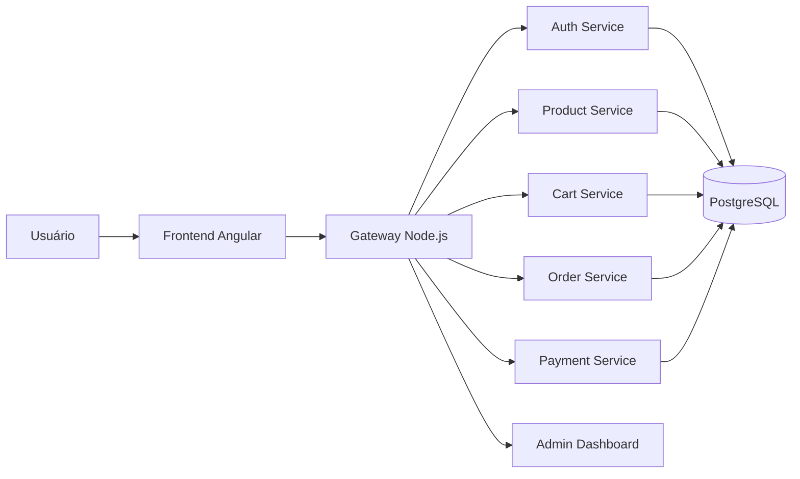

# GBRL-PRO

## Visão geral

O projeto GBRL-PRO é uma aplicação full-stack voltada para uma loja/portal de produtos relacionados a CNC, automação e componentes eletrônicos. A solução foi organizada em uma arquitetura baseada em microsserviços, com um frontend em Angular e um gateway para orquestrar as integrações entre os serviços de autenticação, catálogo, carrinho, pedidos e pagamentos.

O repositório reúne:

- um frontend web moderno e responsivo;
- um gateway em Node.js para roteamento e proxy;
- vários microsserviços Spring Boot para domínios de negócio;
- um banco PostgreSQL para persistência;
- uma configuração Docker Compose para execução simplificada do ambiente.

---

## 1. Objetivo do sistema

O sistema foi pensado para suportar fluxos típicos de e-commerce, incluindo:

- navegação e visualização de produtos;
- autenticação de usuários;
- gerenciamento de carrinho;
- fluxo de pagamento;
- painel administrativo;
- integração de APIs por meio de gateway.

---

## 2. Arquitetura da solução

A arquitetura é composta por três camadas principais:

1. Frontend
   - Interface web construída com Angular.
   - Responsável por renderizar páginas públicas e privadas.

2. Gateway
   - Serviço intermediário em Node.js/Express.
   - Centraliza o roteamento das requisições para os microsserviços.

3. Microsserviços
   - Serviços independentes em Java/Spring Boot.
   - Cada um concentra uma responsabilidade específica do domínio.

### Diagrama simplificado



---

## 3. Tecnologias utilizadas

| Camada | Tecnologia | Função |
|---|---|---|
| Frontend | Angular 20 + TypeScript | Construção da interface web e páginas SPA |
| Frontend | RxJS | Programação reativa e fluxo de dados |
| Frontend | Angular SSR | Renderização no lado do servidor |
| Frontend | SCSS | Estilização dos componentes |
| Gateway | Node.js + Express | API gateway e proxy de requisições |
| Gateway | http-proxy-middleware | Encaminhamento de requisições para os microsserviços |
| Backend | Java 17 | Linguagem principal dos microsserviços |
| Backend | Spring Boot 3.x | Framework para criação dos serviços |
| Backend | Spring Data JPA | Persistência com banco relacional |
| Backend | Maven | Gerenciamento de build e dependências |
| API Docs | Springdoc OpenAPI | Documentação Swagger/UI |
| Banco de dados | PostgreSQL 15 | Armazenamento relacional |
| Infraestrutura | Docker + Docker Compose | Execução do ambiente completo |

---

## 4. Estrutura do repositório

```text
GBRL-PRO/
├── Frontend/                 # Aplicação Angular
├── microservices/            # Microsserviços Spring Boot e gateway
│   ├── authservice/
│   ├── cartservice/
│   ├── gateway/
│   ├── inventoryservice/
│   ├── orderservice/
│   ├── paymentservice/
│   ├── product-api/
│   └── userservice/
├── docker-compose.yml        # Orquestração dos containers
├── .env                      # Variáveis de ambiente
└── README.md                 # Documentação principal
```

### Principais pastas

- [Frontend](Frontend): aplicação web do cliente.
- [microservices/gateway](microservices/gateway): API gateway para encaminhar requisições.
- [microservices/product-api](microservices/product-api): microsserviço de produtos.
- [microservices/authservice](microservices/authservice): autenticação e autorização.
- [microservices/cartservice](microservices/cartservice): gestão de carrinho.
- [microservices/orderservice](microservices/orderservice): fluxo de pedidos.
- [microservices/paymentservice](microservices/paymentservice): processamento de pagamentos.
- [microservices/admindashboard](microservices/admindashboard): painel administrativo.

---

## 5. Pré-requisitos

Antes de executar o projeto localmente, certifique-se de ter instalado:

- Docker Desktop ou Docker Engine
- Docker Compose
- Node.js 20+ e npm
- Java 17
- Maven
- Git

Também é importante ter portas livres para:

- 4000 (frontend)
- 30 (gateway)
- 5432 (PostgreSQL)
- 8080 a 8087 (microsserviços, conforme configuração)

---

## 6. Configuração inicial

O repositório já contém um arquivo [.env](.env) com variáveis base para o ambiente local. Ele define credenciais de acesso ao PostgreSQL e ao RabbitMQ.

Exemplo de configuração esperada:

```env
POSTGRES_USER=admin
POSTGRES_PASSWORD=admin123
POSTGRES_DB=appdb
RABBITMQ_DEFAULT_USER=guest
RABBITMQ_DEFAULT_PASS=guest
```

> Em ambientes com sistema de arquivos sensível a maiúsculas/minúsculas, verifique se os caminhos usados no Docker Compose correspondem exatamente aos nomes das pastas do repositório.

---

## 7. Execução com Docker Compose (recomendado)

A forma mais simples de rodar o ambiente completo é via Docker Compose.

### Passo 1: subir os containers

```bash
docker compose up --build
```

### Passo 2: acessar a aplicação

Após a inicialização, os principais pontos de acesso são:

- Frontend: http://localhost:4000
- Gateway: http://localhost:30
- PostgreSQL: localhost:5432

### Serviços incluídos no compose

O arquivo [docker-compose.yml](docker-compose.yml) orquestra:

- frontend
- gateway
- authservice
- admindashboard
- cartservice
- inventoryservice
- orderservice
- paymentservice
- userservice
- postgres

### Parar os containers

```bash
docker compose down
```

Para remover também os volumes de dados:

```bash
docker compose down -v
```

---

## 8. Execução local sem Docker

### 8.1 Frontend

```bash
cd Frontend
npm install
npm start
```

O frontend ficará disponível em:

```text
http://localhost:4200
```

### 8.2 Gateway

```bash
cd microservices/gateway
npm install
npm start
```

O gateway ficará disponível em:

```text
http://localhost:30
```

### 8.3 Microsserviços Spring Boot

Cada microsserviço pode ser iniciado individualmente com Maven:

```bash
cd microservices/authservice
./mvnw spring-boot:run
```

Exemplo para o microsserviço de produtos:

```bash
cd microservices/product-api
./mvnw spring-boot:run
```

Os demais serviços seguem o mesmo padrão:

```bash
cd microservices/cartservice && ./mvnw spring-boot:run
cd microservices/orderservice && ./mvnw spring-boot:run
cd microservices/paymentservice && ./mvnw spring-boot:run
cd microservices/userservice && ./mvnw spring-boot:run
cd microservices/admindashboard && ./mvnw spring-boot:run
cd microservices/inventoryservice && ./mvnw spring-boot:run
```

---

## 9. Como o sistema funciona

### Fluxo principal

1. O usuário acessa o frontend.
2. O frontend navega por páginas públicas e privadas.
3. As requisições passam pelo gateway.
4. O gateway encaminha para o microsserviço correto.
5. O serviço processa a regra de negócio e persiste os dados no PostgreSQL.
6. A resposta retorna ao frontend para exibição.

### Páginas principais do frontend

O frontend implementa rotas para:

- página inicial / catálogo;
- página de produto;
- login;
- primeiro acesso;
- dashboard privado;
- carrinho;
- pagamento.

---

## 10. Testes

### Testes do frontend

O projeto Angular já contém testes unitários em vários componentes e páginas, com arquivos de spec.

Para executar:

```bash
cd Frontend
npm install
npm run test -- --watch=false --browsers=ChromeHeadless
```

Também é possível validar o build:

```bash
npm run build
```

### Testes dos microsserviços

Cada serviço Spring Boot utiliza o módulo de testes do Spring Boot Starter Test.

Para executar os testes de um serviço:

```bash
cd microservices/product-api
./mvnw test
```

O mesmo comando pode ser repetido para os demais microsserviços.

---

## 11. Documentação de API

O microsserviço de produtos já está configurado com suporte a documentação OpenAPI/Swagger.

Ao executar o serviço, a interface do Swagger pode estar disponível em algo como:

```text
http://localhost:8087/swagger-ui/index.html
```

As rotas do gateway são definidas em [microservices/gateway/routes](microservices/gateway/routes), facilitando o roteamento para os diversos serviços.

---

## 12. Observações técnicas importantes

- O frontend possui uma camada de serviço para produtos e, em sua implementação atual, faz uso de dados mockados em algumas telas, o que indica que a integração real com a API ainda pode estar em evolução.
- A estrutura do projeto já está preparada para evolução para um ambiente mais próximo de produção, com separação de responsabilidades, containerização e uso de microsserviços.
- Algumas configurações de porta e roteamento podem exigir ajustes conforme o ambiente local, principalmente em sistemas operacionais sensíveis a maiúsculas/minúsculas.

---

## 13. Boas práticas para desenvolvimento

- Mantenha os microsserviços com responsabilidades bem delimitadas.
- Utilize o gateway como ponto único de entrada para o frontend.
- Sempre teste os serviços antes de integrá-los com o frontend.
- Prefira a execução via Docker Compose para ambientes de desenvolvimento e validação.
- Mantenha as variáveis de ambiente fora do código-fonte.

---

## 14. Resumo executivo

O GBRL-PRO é um sistema moderno de e-commerce/portal de produtos com arquitetura de microsserviços, frontend Angular e gateway Node.js. Ele oferece uma base sólida para evoluir com autenticação, catálogo, carrinho, pedidos, pagamentos e administração, com foco em modularidade, manutenibilidade e facilidade de implantação via Docker.
